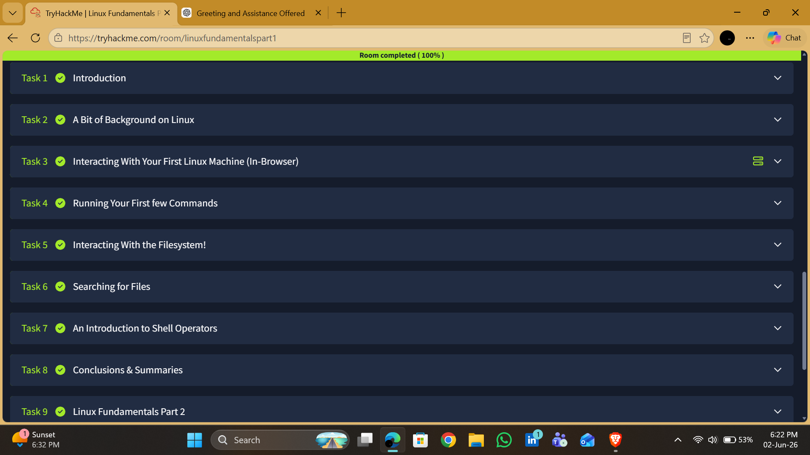

# TryHackMe Walkthrough: Linux Fundamentals Part 1

## Room Information

| Category   | Details                   |
| ---------- | ------------------------- |
| Platform   | TryHackMe                 |
| Room Name  | Linux Fundamentals Part 1 |
| Difficulty | Beginner                  |
| Type       | Linux Fundamentals        |
| Status     | Completed                 |

---

## Overview

Linux Fundamentals Part 1 introduces the Linux operating system and the command-line interface. The room focuses on helping learners understand how to interact with a Linux machine, navigate the filesystem, locate files, and use basic shell operators.

As Linux is widely used across servers, cloud environments, and cybersecurity tools, understanding the fundamentals of Linux is an essential skill for anyone pursuing a career in cybersecurity.

---

## Objectives

The objectives of this room were to:

* Understand the basics of the Linux operating system.
* Learn how to interact with a Linux machine through the terminal.
* Practice navigating the Linux filesystem.
* Learn how to search for files and directories.
* Understand the use of shell operators and command execution.

---

## Tasks Completed

### Task 1: Introduction

Reviewed the room objectives and gained an understanding of what would be covered throughout the Linux Fundamentals series.

**Key Takeaway:** Linux knowledge forms the foundation for many cybersecurity roles and technical environments.

---

### Task 2: A Bit of Background on Linux

Learned about the origins of Linux, its open-source nature, and its widespread use across servers and enterprise environments.

**Key Takeaway:** Linux is one of the most important operating systems in cybersecurity due to its flexibility, stability, and extensive adoption.

---

### Task 3: Interacting With Your First Linux Machine

Connected to a Linux machine and became familiar with interacting through a command-line interface.

**Key Takeaway:** The terminal provides direct access to system functionality and is an essential tool for administrators and security professionals.

---

### Task 4: Running Your First Few Commands

Practiced basic Linux commands such as:

```bash
echo
whoami
pwd
```

**Key Takeaway:** Basic commands provide information about the current user, location within the filesystem, and system interaction.

---

### Task 5: Interacting With the Filesystem

Explored how files and directories are organized within Linux and practiced navigating between locations.

Commands used included:

```bash
ls
cd
cat
```

**Key Takeaway:** Understanding filesystem navigation is crucial when investigating systems, analyzing logs, and locating important files.

---

### Task 6: Searching for Files

Learned how to locate files and directories using Linux search functionality.

Command practiced:

```bash
find
```

**Key Takeaway:** Efficient file searching helps security professionals quickly locate logs, configuration files, and evidence during investigations.

---

### Task 7: An Introduction to Shell Operators

Explored shell operators used to redirect output and combine commands.

Examples included:

```bash
>
>>
&&
```

**Key Takeaway:** Shell operators improve efficiency by allowing commands to be chained together and outputs to be redirected to files.

---

## Skills Developed

This room helped develop:

* Linux command-line proficiency
* Filesystem navigation
* File and directory management
* Search and discovery techniques
* Understanding of shell operators
* Foundational Linux knowledge for cybersecurity

---

## Lessons Learned

1. Linux systems are heavily reliant on command-line interaction.
2. Efficient navigation of the filesystem is an essential technical skill.
3. File searching can significantly improve productivity during investigations.
4. Shell operators enable automation and streamlined workflows.
5. Strong Linux fundamentals support future learning in penetration testing, system administration, and security operations.

---

## Tools Used

* TryHackMe AttackBox
* Linux Terminal
* Web Browser

---

## Conclusion

Linux Fundamentals Part 1 provided a practical introduction to the Linux operating system and command-line environment. Through hands-on exercises, I gained experience navigating the filesystem, executing commands, locating files, and using shell operators. These foundational skills will support future learning in cybersecurity, particularly in areas such as penetration testing, system administration, and security analysis.

---

## Room Completion



---

**Room Completed Successfully**
