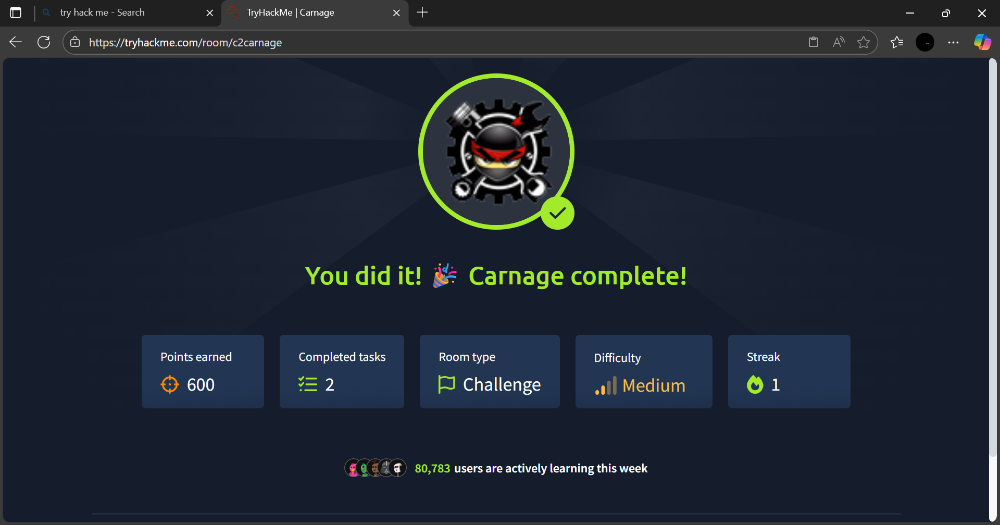

# Carnage

> **Platform:** TryHackMe  
> **Room:** Carnage  
> **Difficulty:** Medium  
> **Category:** Digital Forensics | Incident Response | Malware Analysis

---

## Objective

Investigate a compromised Windows machine to determine how the attack occurred, identify malicious artifacts, uncover persistence mechanisms, and answer investigation questions using forensic evidence.

---

## Skills Learned

- Windows Digital Forensics
- Incident Response
- Malware Investigation
- Event Log Analysis
- Registry Analysis
- File System Investigation
- Persistence Detection
- Threat Hunting
- Evidence Collection

---

## Tools Used

- Event Viewer
- Registry Editor
- Windows Explorer
- PowerShell
- Command Prompt
- TryHackMe AttackBox

---

# Investigation Process

## Scenario

The room simulates a real-world malware incident where a Windows workstation has been compromised. The goal is to investigate the system, collect evidence, and determine the attacker's activities.

---

## Event Log Analysis

Reviewed Windows Event Logs to identify:

- User logins
- Program execution
- Security events
- System activity
- Suspicious behavior

---

## Registry Analysis

Examined registry locations commonly used for persistence, including:

- Run
- RunOnce
- Startup entries

This helped identify how malware could automatically execute after system startup.

---

## File System Investigation

Inspected common locations where malicious files are often stored, including:

- Downloads
- Temp folders
- AppData
- Startup folders

Looked for:

- Suspicious executables
- Recently created files
- Hidden files
- Unusual scripts

---

## Malware Investigation

Analyzed suspicious files to determine:

- File names
- Locations
- Execution history
- Related processes

---

## Persistence Analysis

Investigated persistence mechanisms by checking:

- Registry autoruns
- Startup folders
- Scheduled Tasks

---

## Indicators of Compromise (IOCs)

Collected valuable forensic evidence, including:

- Suspicious file paths
- Malicious executables
- Registry entries
- System artifacts
- Evidence of attacker activity

---

# Key Takeaways

This room reinforced the importance of following a structured incident response process and collecting evidence before making changes to a compromised system.

Key lessons learned:

- Windows Event Logs provide valuable forensic evidence.
- Registry analysis is essential for identifying persistence mechanisms.
- Malware frequently hides within user directories such as AppData.
- File system analysis helps uncover suspicious artifacts.
- A systematic investigation makes it easier to reconstruct attacker activity.

---

# What I Practiced

- Windows forensic investigations
- Malware analysis
- Registry examination
- Event log analysis
- Persistence detection
- Threat hunting
- Incident response methodology

---

# Room Status

**Completed** ✅

**Difficulty:** Medium

---

## Screenshot

## Completion Badge

---

## Conclusion

The Carnage room provided practical experience in investigating a compromised Windows machine using forensic techniques. It strengthened my understanding of incident response, malware persistence, Windows artifacts, and evidence collection, reinforcing the importance of a methodical approach during security investigations.
