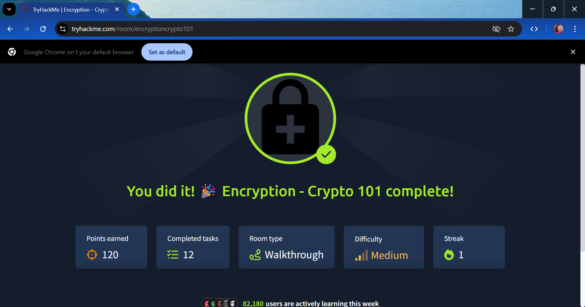

# Encryption - Crypto 101

> **Room:** Encryption - Crypto 101  
> **Platform:** TryHackMe  
> **Difficulty:** Medium  
> **Status:** ✅ Completed

---

## Overview

This room introduced the fundamental concepts of cryptography and how encryption protects information from unauthorized access. I explored the differences between encryption, encoding, and hashing while learning how cryptographic algorithms maintain confidentiality, integrity, and authenticity.

---

## Objectives

- Understand what cryptography is
- Learn the difference between encryption, encoding, and hashing
- Explore symmetric and asymmetric encryption
- Understand Public Key Infrastructure (PKI)
- Learn how digital signatures work
- Understand certificates and Certificate Authorities (CAs)
- Learn where cryptography is used in everyday cybersecurity

---

## Key Concepts Learned

### Encryption

Encryption converts readable information (plaintext) into unreadable data (ciphertext) using a cryptographic algorithm and a key. Only someone with the correct decryption key can recover the original message.

---

### Symmetric Encryption

Symmetric encryption uses a single shared key for both encryption and decryption.

**Examples:**
- AES
- DES
- 3DES

**Advantages**
- Fast
- Efficient for encrypting large amounts of data

**Disadvantages**
- Requires a secure way to share the key

---

### Asymmetric Encryption

Asymmetric encryption uses two keys:

- Public Key
- Private Key

The public key encrypts data, while the private key decrypts it.

**Examples:**
- RSA
- ECC

**Advantages**
- Secure key exchange
- Enables digital signatures

**Disadvantages**
- Slower than symmetric encryption

---

### Hashing

Hashing converts data into a fixed-length value.

**Key characteristics:**

- One-way function
- Cannot be reversed
- Same input always produces the same output
- Small input changes produce completely different hashes

**Examples:**

- SHA-256
- SHA-512
- MD5 (Legacy)
- SHA-1 (Legacy)

**Common Uses**

- Password storage
- File integrity verification
- Digital signatures

---

### Encoding

Encoding converts data into another format for compatibility rather than security.

**Examples**

- Base64
- ASCII
- UTF-8

Unlike encryption, encoded data can be decoded without a secret key.

---

### Digital Signatures

Digital signatures verify:

- Authenticity
- Integrity
- Non-repudiation

They are created using the sender's private key and verified using the sender's public key.

---

### Digital Certificates

Certificates verify the identity of websites and systems.

They contain information such as:

- Public Key
- Organization Name
- Expiration Date
- Certificate Authority (CA)

Certificates enable secure HTTPS communication.

---

### Public Key Infrastructure (PKI)

PKI manages:

- Digital certificates
- Public and private keys
- Certificate Authorities
- Trust relationships

PKI is the foundation of secure internet communication.

---

## Practical Skills Gained

After completing this room, I can:

- Explain the purpose of encryption
- Differentiate encryption, hashing, and encoding
- Describe symmetric and asymmetric encryption
- Explain digital signatures
- Understand certificates and PKI
- Identify common cryptographic algorithms

---

## Real-World Applications

Cryptography is used in:

- HTTPS websites
- VPNs
- SSH
- Password storage
- Digital certificates
- Email encryption
- Secure messaging applications
- Banking systems
- Cryptocurrency
- File encryption

---

## Key Takeaways

- Encryption protects confidentiality.
- Hashing protects integrity.
- Encoding is for data compatibility, not security.
- Symmetric encryption is fast but requires secure key sharing.
- Asymmetric encryption enables secure communication over untrusted networks.
- Digital signatures verify authenticity and integrity.
- PKI establishes trust across the internet.

---

## Tools & Technologies

- Cryptography
- AES
- RSA
- ECC
- SHA-256
- Base64
- PKI
- SSL/TLS
- Digital Certificates
- Digital Signatures

---

## What I Learned

This room strengthened my understanding of the cryptographic techniques that secure modern systems. I now understand how encryption, hashing, certificates, and digital signatures work together to protect data, verify authenticity, and establish trust in digital communications.

---

## Room Status

- **Status:** ✅ Completed
- **Difficulty:** Medium
- **Platform:** TryHackMe
