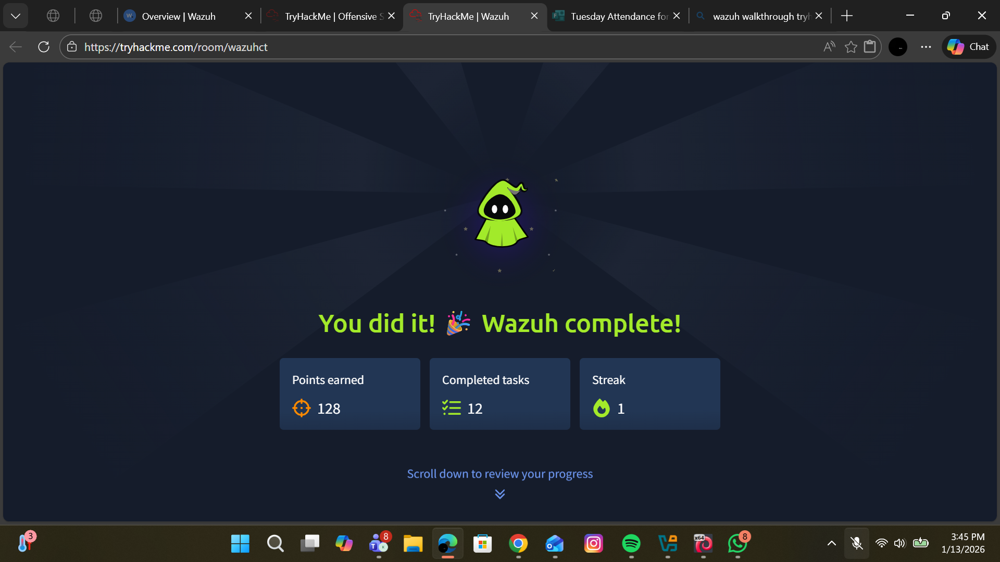

# Wazuh

## 📝 Room Information

| Category | Details |
|----------|----------|
| Platform | TryHackMe |
| Room | Wazuh |
| Difficulty | Easy |
| Topics Covered | SIEM, Wazuh, Security Monitoring, Log Analysis, Threat Detection, MITRE ATT&CK, Security Operations |

---

## 🎯 Objective

The objective of this room is to gain hands-on experience with **Wazuh**, an open-source Security Information and Event Management (SIEM) platform. The room introduces the Wazuh dashboard, security monitoring, endpoint visibility, log analysis, alert investigation, and threat detection techniques used by Security Operations Centers (SOCs).

---

## 📚 Skills Learned

- Understanding the role of a SIEM
- Navigating the Wazuh Dashboard
- Investigating security alerts
- Monitoring endpoint activity
- Reviewing authentication events
- Analyzing logs
- Mapping alerts to the MITRE ATT&CK framework
- Detecting suspicious activity
- Understanding security monitoring workflows

---

## 🔍 Key Concepts

### What is Wazuh?

Wazuh is an open-source SIEM and XDR platform used to:

- Collect logs from endpoints
- Detect security threats
- Monitor system integrity
- Identify malware
- Detect brute-force attacks
- Monitor compliance
- Support incident response

---

## 🛠️ Tasks Completed

- ✔ Explored the Wazuh interface
- ✔ Reviewed Security Events
- ✔ Investigated Authentication Logs
- ✔ Examined Agent Status
- ✔ Viewed Vulnerability Detection
- ✔ Analyzed File Integrity Monitoring
- ✔ Investigated Security Alerts
- ✔ Explored MITRE ATT&CK Mapping
- ✔ Reviewed Dashboard Components
- ✔ Completed Alert Investigation Exercises
- ✔ Learned Security Monitoring Techniques
- ✔ Completed all room questions

---

## 💡 What I Learned

This room strengthened my understanding of how Security Operations Centers monitor infrastructure using a SIEM. I learned how Wazuh aggregates logs from endpoints, generates alerts, maps detections to MITRE ATT&CK techniques, and assists analysts in identifying suspicious behavior. I also became more comfortable navigating dashboards and interpreting security events during investigations.

---

## 📸 Room Completion

> Save your completion screenshot inside this folder as:

```
Wazuh.png
```

Then display it using:

```markdown
## 🖼️ Completion Badge


```

---

## 🚀 Outcome

Successfully completed the **Wazuh** room and gained practical exposure to:

- Security Information and Event Management (SIEM)
- Log collection and analysis
- Threat detection
- Endpoint monitoring
- Incident investigation
- MITRE ATT&CK mapping
- Security Operations Center (SOC) workflows

---

## 📖 Author

**Purity Kariuki**

Cybersecurity | SOC Analyst | Blue Team | Threat Detection | TryHackMe Learner
