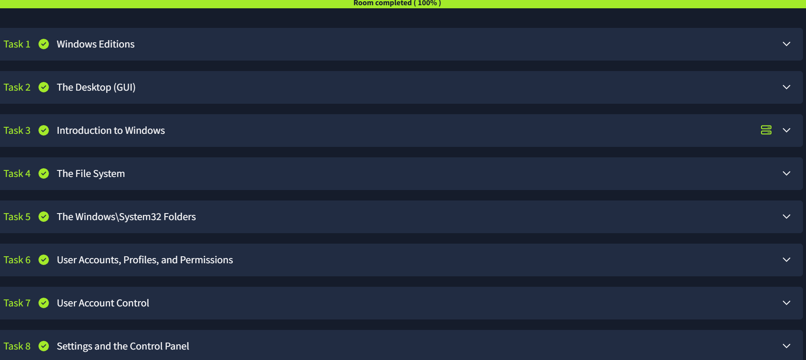

# Windows Fundamentals 1 – TryHackMe Walkthrough

## Room Overview

This room introduced the core components of the Windows operating system, including Windows editions, the graphical user interface (GUI), file systems, user account management, and system administration features.

## Skills Learned

* Understanding Windows editions
* Navigating the Windows Desktop GUI
* Exploring the Windows file system
* Understanding the System32 directory
* Managing user accounts and permissions
* Understanding User Account Control (UAC)
* Navigating Settings and Control Panel

---

## Task 1: Windows Editions

### Key Concepts

Windows is available in multiple editions, each designed for different use cases.

Common editions include:

* Home
* Pro
* Enterprise
* Education

### What I Learned

Different editions provide varying levels of security, administration, and enterprise functionality.

---

## Task 2: The Desktop (GUI)

### Key Concepts

The Windows GUI provides an interface for interacting with the operating system without command-line commands.

### Components Explored

* Start Menu
* Taskbar
* Desktop
* Notification Area
* Search Function

### What I Learned

The GUI serves as the primary navigation method for most Windows users.

---

## Task 3: Introduction to Windows

### Key Concepts

Windows is one of the most widely used operating systems worldwide and provides support for desktop, enterprise, and server environments.

### What I Learned

Understanding Windows fundamentals is essential for IT support and cybersecurity roles.

---

## Task 4: The File System

### Key Concepts

Windows primarily uses the NTFS file system.

### Features of NTFS

* File permissions
* Encryption support
* Compression
* Disk quotas

### What I Learned

NTFS provides security and management features that are important for system administration.

---

## Task 5: Windows\System32 Folder

### Key Concepts

System32 contains critical Windows operating system files.

### Important Notes

* Stores system libraries and executable files
* Essential for operating system functionality
* Modifying files improperly can cause system instability

### What I Learned

System32 is one of the most important directories within Windows.

---

## Task 6: User Accounts, Profiles, and Permissions

### Key Concepts

Windows uses accounts and permissions to control access to resources.

### Account Types

* Administrator
* Standard User

### What I Learned

Permissions help protect systems by limiting user access based on role.

---

## Task 7: User Account Control (UAC)

### Key Concepts

UAC helps prevent unauthorized changes to the operating system.

### Benefits

* Reduces malware impact
* Requires confirmation for administrative actions
* Improves overall system security

### What I Learned

UAC is a critical Windows security feature that supports the principle of least privilege.

---

## Task 8: Settings and Control Panel

### Key Concepts

Windows provides multiple interfaces for system configuration.

### Areas Explored

* System Settings
* Network Settings
* User Accounts
* Device Management

### What I Learned

Both Settings and Control Panel are important tools for managing Windows systems.

---

## Key Takeaways

* Windows editions provide different capabilities for users and organizations.
* NTFS is the primary file system used by Windows.
* System32 contains essential operating system files.
* User permissions help secure systems.
* UAC protects against unauthorized administrative actions.
* Settings and Control Panel provide system management functionality.

## Tools Used

* TryHackMe
* Windows Operating System

## Status

## Room Completion

