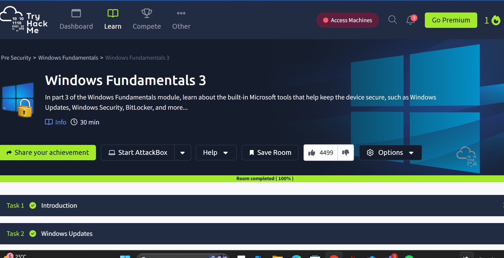

# Windows Fundamentals 3

## Room Information

| Category | Details |
|------------|----------------|
| Platform | TryHackMe |
| Room | Windows Fundamentals 3 |
| Difficulty | Easy |
| Completion Status | ✅ Completed |
| Focus Areas | Windows Security, BitLocker, Windows Updates, Windows Security Center, Volume Shadow Copy Service |

---

# Objective

This room introduces the built-in security tools available in Microsoft Windows and explains how they help protect systems against threats, data loss, and unauthorized access.

The room covers:

- Windows Updates
- Windows Security
- Virus & Threat Protection
- Firewall & Network Protection
- App & Browser Control
- Device Security
- BitLocker
- Volume Shadow Copy Service (VSS)

---

# Learning Outcomes

After completing this room I can:

- Explain the importance of keeping Windows updated
- Navigate Windows Security settings
- Understand Microsoft Defender capabilities
- Describe how Windows Firewall protects a device
- Explain the purpose of BitLocker encryption
- Understand the role of Volume Shadow Copy Service (VSS)
- Recognize built-in Windows security features that improve endpoint protection

---

# Task 1 - Introduction

This room focuses on Microsoft's built-in security technologies designed to protect both users and data.

Windows includes several native security components that work together to reduce vulnerabilities and defend against malware.

### Key Takeaways

- Security should be layered.
- Regular updates reduce exposure to vulnerabilities.
- Built-in Windows tools provide significant protection without additional software.

---

# Task 2 - Windows Updates

Windows Update is Microsoft's service for delivering:

- Security patches
- Feature updates
- Bug fixes
- Driver updates

Keeping systems updated is one of the simplest and most effective cybersecurity practices.

### Update Categories

### Quality Updates

Released frequently and contain:

- Security patches
- Reliability improvements
- Bug fixes

### Feature Updates

Released less often and include:

- New Windows functionality
- Performance improvements
- Interface changes

### Why Updates Matter

Outdated systems are vulnerable to publicly known exploits that attackers actively target.

---

# Task 3 - Windows Security

Windows Security acts as the central dashboard for protecting a Windows device.

It includes multiple protection modules accessible from a single interface.

Main sections include:

- Virus & Threat Protection
- Account Protection
- Firewall & Network Protection
- App & Browser Control
- Device Security
- Device Performance & Health
- Family Options

---

# Task 4 - Virus & Threat Protection

This section is powered by Microsoft Defender Antivirus.

Functions include:

- Real-time protection
- Quick scans
- Full system scans
- Offline scans
- Ransomware protection

### Real-Time Protection

Continuously monitors files and running processes to detect malicious activity.

### Scan Types

| Scan | Purpose |
|----------------|----------------------------|
| Quick Scan | Checks common malware locations |
| Full Scan | Examines the entire system |
| Custom Scan | User-selected folders |
| Offline Scan | Detects deeply embedded malware |

---

# Task 5 - Firewall & Network Protection

Windows Defender Firewall filters incoming and outgoing network traffic.

Its goal is to prevent unauthorized access while allowing legitimate communication.

Network profiles include:

- Domain Network
- Private Network
- Public Network

Each profile can have different firewall rules depending on the environment.

---

# Task 6 - App & Browser Control

This feature protects users against malicious applications and unsafe websites.

It provides:

- SmartScreen filtering
- Reputation-based protection
- Exploit protection

These technologies help prevent users from downloading or executing potentially dangerous files.

---

# Task 7 - Device Security

Device Security focuses on hardware-assisted protections.

Examples include:

- Secure Boot
- TPM (Trusted Platform Module)
- Core Isolation
- Memory Integrity

These features make it significantly more difficult for malware to compromise the operating system during startup.

---

# Task 8 - BitLocker

BitLocker is Microsoft's full-disk encryption solution.

Its purpose is to protect stored data if a device is lost or stolen.

### Benefits

- Encrypts entire drives
- Prevents unauthorized access
- Works with TPM hardware for secure key storage

Without the recovery key or proper authentication, encrypted data remains inaccessible.

---

# Task 9 - Volume Shadow Copy Service (VSS)

Volume Shadow Copy Service creates snapshots of files and system data.

These snapshots can be used for:

- System Restore
- File recovery
- Backup operations

### Security Perspective

Attackers often attempt to delete VSS snapshots after deploying ransomware to prevent victims from restoring their files.

Common command used by attackers:

vssadmin delete shadows

Monitoring this activity can help identify malicious behavior.

---

# Key Cybersecurity Concepts Learned

✅ Defense in Depth

Using multiple security controls instead of relying on a single solution.

✅ Endpoint Protection

Protecting user devices using antivirus, firewalls, updates, and encryption.

✅ Data Encryption

BitLocker ensures stored data remains confidential even if physical devices are compromised.

✅ System Recovery

Volume Shadow Copy Service provides recovery points that improve resilience against accidental deletion and some attacks.

---

# Skills Demonstrated

- Windows Operating System Fundamentals
- Windows Security Navigation
- Microsoft Defender Basics
- Firewall Concepts
- Disk Encryption
- Backup & Recovery Concepts
- Endpoint Security Awareness

---

# Tools & Technologies

- Windows 10 / Windows 11
- Microsoft Defender
- Windows Update
- Windows Defender Firewall
- BitLocker
- Volume Shadow Copy Service (VSS)

---

# Personal Notes

This room strengthened my understanding of the security features built directly into Windows. I learned that endpoint security is achieved through multiple layers including updates, antivirus protection, firewalls, encryption, and recovery mechanisms. Understanding how these components work together provides a solid foundation for both defensive security practices and future blue team investigations.

---

## Repository Structure
